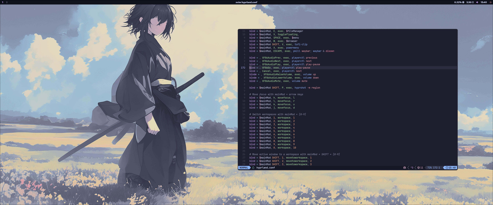

# My Dotfiles

## Zsh configuration

Install zsh in arch with `sudo pacman -S zsh` and then set it as default shell with `chsh -s $(which zsh)`.

Then install `zsh-syntax-highlighting` and `zsh-autosuggestions` with `yay -S zsh-syntax-highlighting zsh-autosuggestions`.

This config uses `powerlevel10k` as it's the most optimized and fastest theme, install it with `yay -S zsh-theme-powerlevel10k`.
